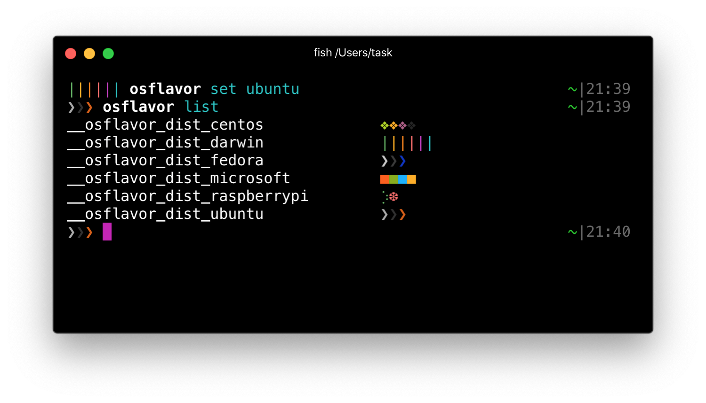

# osflavor
> Add OS-flavored symbols to your [fish shell](https://fishshell.com/) prompt.



## Installation
Install with [jorgebucaran/fisher](https://github.com/jorgebucaran/fisher).
```console
$ fisher install eholic/osflavor
```

 Add `(__osflavor)` in your `.config/fish/functions/fish_prompt.fish`.

```fish
# example
function fish_prompt
    set -g __osflavor_last_status $status # must be first line of code
    # your prompt settings here
    echo -n -s (__osflavor) (__fish_git_prompt " %s") ' '
end
```

 ## Customization
 The prompt symbols for each distribution can be specified using `__osflavor_dist_<name>`.
 `<name>` should be *lower-case* substring contained within `uname -a`.

```console
# example
$ set -g __osflavor_dist_darwin ">"
$ set -g __osflavor_dist_centos (set_color 9ccd2a)"⬉"(set_color a14f8c)"⬈"(set_color efa724)"⬊"(set_color 262577)"⬋"
```
